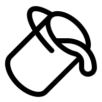
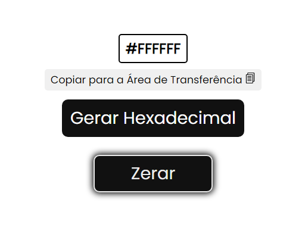
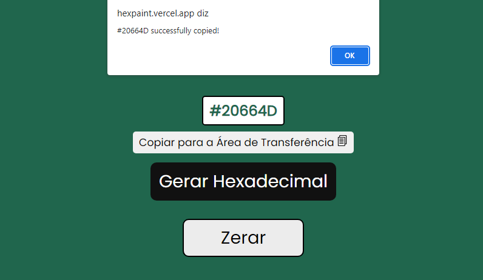
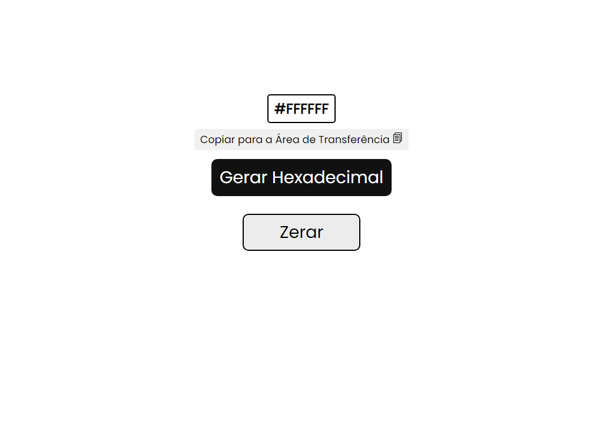
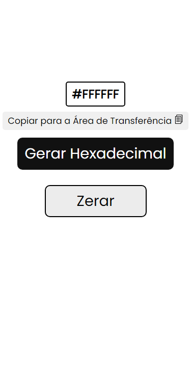

<h1 align="center"><h1>
<h1 align="center">Hex Paint</h1>

<a href="https://hexpaint.vercel.app">Clique para visualizar o projeto.</a>

<h1>Sumário:</h1>

* [Sobre](#about)
* [Funcionalidades](#functionalities)
    * [Zerar&nbsp;Cores](#reset)
    * [Copiar&nbsp;para&nbsp;a&nbsp;Área&nbsp;de&nbsp;Transferência.](#copytoclipboard)
* [Tecnologias](#technologies)
* [Dispositivos](#devices)
    * [Desktop](#desktop)
    * [Mobile](#mobile)
* [Licença](#license)
* [Autor](#author)

<h1 id="about">Sobre</h1>

<a href="https://hexpaint.vercel.app">Hex Paint</a> é uma aplicação web própria para desenvolvedores e designers. Com todas suas funcionalidades desenvolvidas com Javascript.

<h1 id="functionalities">Funcionalidades</h1>

A funcionalidade geral da aplicação é a geração completamente aleatória de cores diversas do código hexadecimal, contando também com a opção de <a href="#reset">Zerar cores</a> e a possibilidade de <a href="#copytoclipboard">Copiar para a área de transferência</a>. Além de tudo é possível guardar a cor gerada por último no Armazenamento Local do navegador (Local Storage).

<h1 id="reset">Zerar Cores</h1>

Aparência de quando o botão <strong>Zerar</strong> é ativado.

 

Funciona como um "reset" para a cor padrão (#FFFFFF). Essa reinicialização também fica salva no Armazenamento local.

<h1 id="copytoclipboard">Copiar para a área de transferência</h1>

Mensagem exibida após clicar no botão <strong>Copiar para a Área de Transferência</strong>.

 

Funcionalidade desenvolvida inteiramente com Javascript. Consiste na cópia automática do conteúdo, ou seja, da cor mais recente gerada pelo usuário, possibilitando sua inserção em qualquer lugar, através da Área de Transferência (Clipboard).

<h1 id="technologies">Tecnologias</h1>

As tecnologias utilizadas durante o desenvolvimento foram:
<ul>
<li><a href="https://html.com/" title="HTML">HTML (Hyper Text Markup Language)</a></li>
<li><a href="https://css-tricks.com/" title="CSS">CSS (Cascading Style Sheet)</a></li>
<li><a href="https://www.javascript.com/" title="Javascript">JS (Javascript)</a></li>
</ul>

<h1 id="devices">Dispositivos</h1>

Além de útil, o Hex Paint também é responsivo, possuindo layouts para <a href="#desktop" title="desktop">computadores</a> e <a href="#mobile" title="mobile">dispositivos móveis</a>.

<h1 id="desktop">Desktop</h1>

A aplicação foi desenvolvida primeiramente para dispositivos grandes, como computadores ou laptops. Veja abaixo a experiência em Desktop:

<h1 align="center"><h1>

<h1 id="mobile">Mobile</h1>

Mas é claro que não poderia faltar a responsividade para dispositivos móveis, como smartphones e tablets. Veja abaixo a experiência em Mobile:

<h1 align="center"><h1>

<h1 id="license">Licença ⚖️</h1>

A licença utilizada no projeto foi a <a href="https://mit-license.org/">MIT LICENSE</a>.

<h1 id="author">Autor</h1>

Projeto desenvolvido por <a href="https://github.com/EduDevCode" title="Eduardo M. dos S. Delfino">Eduardo M. dos S. Delfino</a>.
